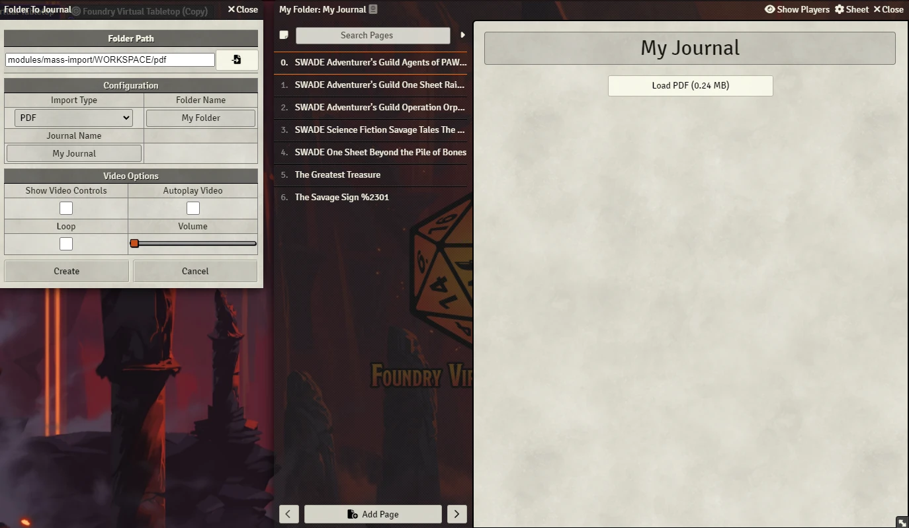

# Folder Mass Import
This module makes easier to import data into the world. It'll read a folder with images, videos or PDFs and turn then into Foundry VTT entities.

## Examples
- Read a folder with images and make all of them scenes.
- Read a folder with images and turn all of them into a deck.
- Read a folder with images and create one page for image.
- Read a folder with images and create one journal for each image.
- Read a folder with images and turn all of them into one text page.
- Read a folder with PDFs and turn into journal pages
- Read a folder with Videos and turn into journal pages

## Macros    

  

## Deck Example

  

## Scene Example

  

## Journal Examples

### Journal Image Example

  

### Journal Video Example

  

### Journal PDF Example

  

# Instalation
You can install this module using the manifest: https://raw.githubusercontent.com/brunocalado/mass-import/main/module.json

# How To
After install and activate the module go to the compendiums and search for **Macros - Mass Import**. 

If you need more information go the the **Journal - Mass Import** and read the journal with instructions in there.

# Community
- Do you have something to improve this module? [Share it!](https://github.com/brunocalado/mass-import/issues)
- Do you find out a bug? [Report it!](https://github.com/brunocalado/mass-import/issues)

# Changes
You can see changes at [CHANGELOG](CHANGELOG.md).

# License and Assets
- Code license at [LICENSE](LICENSE).

# Mestre Digital
About this module creator: https://sites.google.com/view/mestredigitalmodules